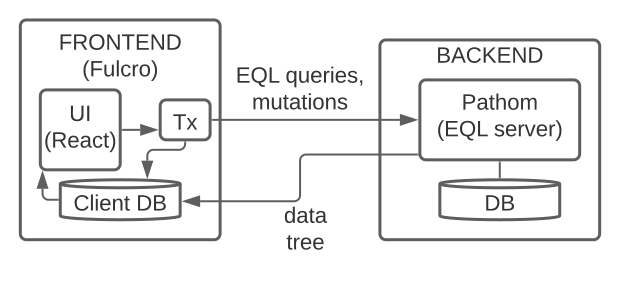

# A very brief introduction to Fulcro

## Workshop agenda

1. Intro (here)
2. Workshop exercises
3. Q&A session
4. Coding exercises from fulcro-exercises

## Fulcro intro

_Disclaimer: I'm not going to talk much about WHY things are they way they are. Read https://fulcro-community.github.io/guides/tutorial-minimalist-fulcro/index.html#_why_fulcro to learn about that._

### Why Fulcro?

Because it provides a complete, integrated model for building non-trivial business applications that span front- and backend. No more tons of plumbing code, editing N disparate places, searching for string IDs!

### What is Fulcro?

Fulcro is a full-stack web framework for a _graph API_. Let's unpack that:

* Full-stack = both _frontend_ and _backend_
* On the _frontend_ we have a **UI** tree composed of React _components_
* It talks to a **graph API** on the _backend_ to query for data and to effect _mutations_ (changes)
  * A single endpoint (x REST)
  * _Frontend describes_ what data it wants using EDN Query Language (EQL) and _backend fills them in_, returning a data tree
* On the _backend_ we have _Pathom_ - Fulcro's twin library (cljc) that _parses_ EQL and answers with data
  * You code _resolvers_ that provide parts of the answer
  * Your Pathom resolvers typically talk to a DB such as Datomic and PostgreSQL or remote REST APIs



Let's zoom in on the Frontend. It has:

* the **UI** component tree
* a client-side **state**, called "client DB", and storing data mostly in a _normalized_ form
* an asynchronous **transaction** subsystem ("Tx") for triggering local and remote mutations and data loads from the components

Let's zoom in even more, on the UI tree and its rendering:


1. Fulcro asks the `Root` component for its _query_, which composes the queries of its children (and so forth)
2. Fulcro fulfills the query using the data in the client DB, producing a tree of data, also known as _props_ (= properties)
3. Fulcro invokes the Root's render function passing it the props tree; Root in turn renders its children, passing them the relevant sub-trees

### Fulcro component

What is a Fulcro component anyway?

```clojure
(defsc <Name> [this props]
  {<config options>} ; :query, :ident, ...
  (dom/div 
    (dom/h1 "Hello" (:name props) "!")
    (some-child-component (:some-child props))))
```

### Keyword cloud

* Component
* Component tree
* Data tree
* Mutation
* Transaction
* Client DB
* EQL
* Query

TP: You do not need to understand everything here. We will be coming back to these terms in the exercises. There you will experience and grok them.